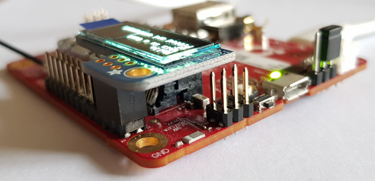

I2C Pi OLED display support on mangOH Red
============

This contribution is proposing a Legato api component to enable your application to display text on the Adafruit i2C Pi Oled panel plugged onto mangOH-Red's Raspberry Pi connector.

The current code is supporting text display up to 4 lines, using a 128x32 patterns Oled display panel.
The Adafruit i2c Pi Oled's 6 pins connector should be connected to Raspberry's Pins 1 through Pin 6, as shown below:

We can see on the [mangOH Red schematic](https://mangoh.io/uploaded-documents/Reference/mangOH%20Red/Hardware/Schematics/2500927_DV5.pdf), i2C lines (SCL_EXP and SDA_EXP) on the Raspberry Pi header, are wired to TCA9546A's SC3 & SD3. TCA9546A serves as an i2c expander and can mulitplex up to 4 i2C buses.

In order to use the i2c bus on the Raspberry Pi header, TCA9546A kernel driver is required in your legato system. Generic WP module firmwares do not provide this kernel driver.

Prerequisite
------------

- Build your legato system from this [mangOH.sdef project](https://github.com/mangOH/mangOH) which includes all necessary kernel drivers to support mangOH Red sensors and i2C on Raspberry Pi header.
- Once you have built and installed this custom legato system for mangOH Red, make sure you have the following i2c buses

    ~~~
    root@swi-mdm9x28:~# i2cdetect -l
    i2c-4   i2c         MSM-I2C-v2-adapter                  I2C adapter
    i2c-5   i2c         i2c-4-mux (chan_id 0)               I2C adapter
    i2c-6   i2c         i2c-4-mux (chan_id 1)               I2C adapter
    i2c-7   i2c         i2c-4-mux (chan_id 2)               I2C adapter
    i2c-8   i2c         i2c-4-mux (chan_id 3)               I2C adapter
    ~~~

    i2c-4 is the main i2c bus.

    i2c-5, i2c-6, i2c-7 and i2c-8 are created by the TCA954x kernel driver to map to the multiplexed i2c buses : respectively SD0/SC0, SD1/SC1, SD3/SC3 and SD3/SC3

- i2C lines (SDA_EXP and SCL_EXP) on the Raspberry Pi header are therefore represented by i2c-8 (wired to SD3/SC3). Now make sure that the Pi Oled is detected on i2b bus 8 (i2c-8) with the i2c address 0x3C

    ~~~
    root@swi-mdm9x28:~# i2cdetect -y -r 8
     0  1  2  3  4  5  6  7  8  9  a  b  c  d  e  f
    00:          -- 04 05 06 07 -- -- -- -- -- -- -- -- 
    10: -- -- -- -- -- -- -- -- -- -- UU -- -- -- -- -- 
    20: -- -- -- -- -- -- -- -- -- -- -- -- -- -- -- -- 
    30: -- -- -- -- -- -- -- -- -- -- UU -- 3c -- -- -- 
    40: -- -- -- -- -- -- -- -- -- -- -- -- -- -- -- -- 
    50: -- UU -- -- -- -- -- -- -- -- -- -- -- -- -- -- 
    60: -- -- -- -- -- -- -- -- UU -- -- -- -- -- -- -- 
    70: -- UU -- -- -- -- UU --
    ~~~

    From this point, the Pi Oled can be addressed programatically on /dev/i2c-8 with the address 0x3c (as displayed on the back of the Pi Oled panel).
    The PiOled api component can now be used to display text.

piOled api component
------------

For now, this component is only exposing one function

~~~
    FUNCTION le_result_t Display
    (
        string          message[64]         IN,     //only display 22 characters per line
        uint8           line                IN      //line number : 0 - 3
    );
~~~

Tester app
----------

There is a test app in the testPiOled folder.
